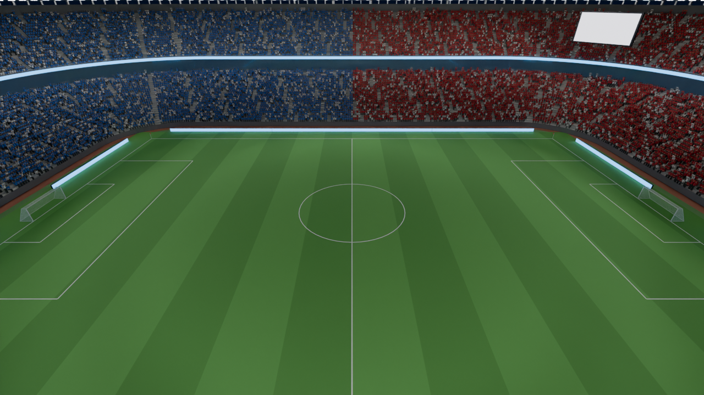
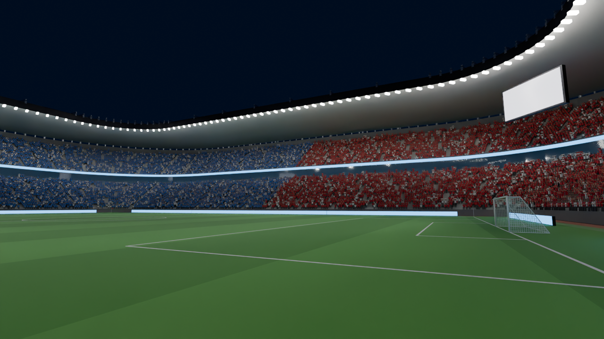
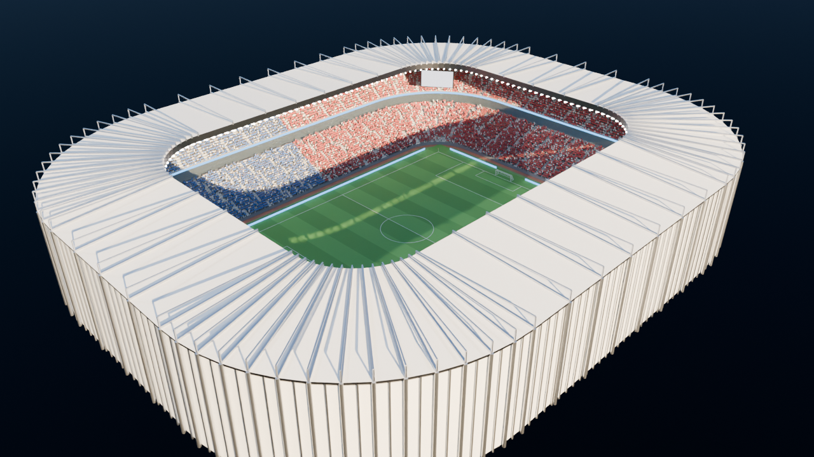
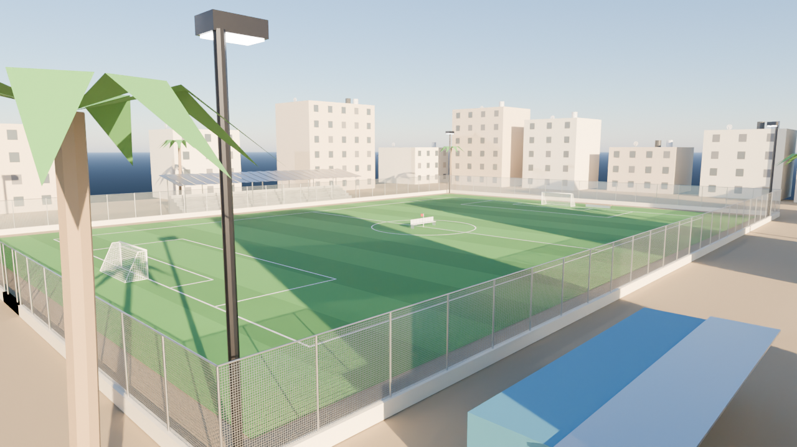
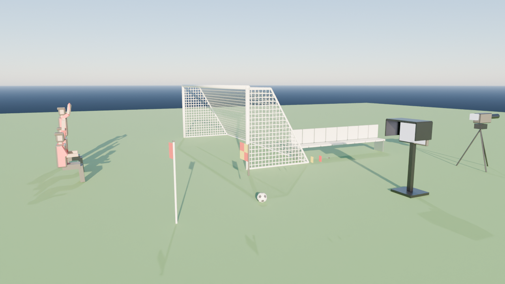

# مسيرة حكم — Referee Career

لعبة محاكاة لمسيرة حكم كرة قدم كاملة، تبدأ بمباريات **دوري الأحياء** وتنتهي بإطلاق صافرة **نهائي كأس العالم**. المشروع مبني على **Unreal Engine 5**، والملاعب والأدوات مولّدة بسكربتات **Blender**.



| | |
|---|---|
|  |  |
|  |  |

*صور مُصيَّرة بمحرك Cycles في Blender من الأصول الموجودة في هذا المستودع، وليست لقطات من Unreal.*

## الفكرة باختصار

- **داخل الملعب:** تختار دورك، فتكون **حكم الساحة** أو **حكم الراية** أو **حكم الفيديو (VAR)**. في كل لقطة يتباطأ الزمن ولديك ثوانٍ لتقرر. ما تراه يعتمد على موقعك فعلاً، أي على المسافة وزاوية النظر وما إذا كان أحد اللاعبين يحجب رؤيتك. بعد القرار قد يحتجّ عليك اللاعبون والمدربون، وطريقة تعاملك معهم تؤثر في **حرارة المباراة** وفي **هدوئك**. يمكنك أن تتنفّس بعمق لتستعيد هدوءك قبل اللقطة التالية.
- **حكم الفيديو:** تراجع الإعادة من عدة زوايا بنصف السرعة، وتقدّم اللقطة وترجعها، وتُظهر خطوط التسلل. القاعدة هي البروتوكول الحقيقي: لا تتدخل إلا في **الخطأ الواضح والجلي**.
- **خارج الملعب:** تخطط لأسبوعك بأنشطة مثل تدريب اللياقة ودراسة القانون وتحليل الفيديو ودورة حكام الفيديو والجلسات النفسية والراحة. تواجه الإعلام بعد القرارات الجدلية، وتمر بأحداث تمسّ الأخلاق، مثل عرض للتلاعب بالنتائج: هل **ترفض**، أم **تُبلّغ** (فتبدأ قصة تحقيق وكمين)، أم **تقبل** (وتعيش مع خطر الانكشاف)؟
- **السمعة:** ثلاثة مؤشرات هي **العدالة** و**الشخصية** و**ثقة الاتحاد**، ومعها لياقتك وتقييمات المراقب، تحدد **مؤشر التعيين**. هذا المؤشر يقرر أي المباريات الكبيرة تُرشَّح لها: الديربي ونهائي الكأس ونهائي القارة ونهائي كأس العالم. واللعبة تخبرك صراحةً لماذا لم تُرشَّح ("ثقة الاتحاد 58 والمطلوب 63").
- **المسيرة:** سبع درجات، من دوري الأحياء إلى كأس العالم. الترقية والهبوط مرتبطان بمتوسط التقييم وشروط كل درجة، وهناك ثماني نهايات مختلفة.

التفاصيل الكاملة في [وثيقة تصميم اللعبة](docs/GDD.md).

## ما الجاهز، وما الذي تم التحقق منه

| الجزء | الحالة |
|---|---|
| **قواعد اللعبة (RefCore)**: المسيرة، والسمعة، والتعيينات، والحوادث وقانون اللعبة، وما يراه الحكم، وبروتوكول VAR، والاعتراضات، والمؤتمر الصحفي، والأحداث الأخلاقية، والنهايات، والحفظ | ✅ مكتوبة بلغة C++ مستقلة عن المحرك، وتجتاز **262 فحصاً آلياً**، ومحاكي يلعب مئات المسيرات للتحقق من التوازن (النتائج في GDD) |
| **محتوى اللعبة** (سبع درجات و58 فريقاً و29 نوع حادثة و23 حدثاً و12 نشاطاً تدريبياً وأسئلة الصحافة و250 نصاً عربياً) | ✅ ملفات JSON في `RefereeCareer/Content/Data` يمكن تعديلها دون برمجة |
| **أصول Blender**: ملعب من 45 ألف مقعد، وملعب أحياء، ومرمى، وراية، وكرة، وبطاقات، وصافرة، وشاشة VAR، وجمهور | ✅ مولّدة بسكربتات وجرى تصديرها FBX وتصييرها (الصور أعلاه) |
| **طبقة Unreal Engine 5**: الذكاء الاصطناعي لكرة القدم، وتجهيز الحوادث أمامك، وقياس الرؤية بخطوط النظر، والحركة البطيئة، والبطاقات والطرد، والإعادة وغرفة الفيديو وخطوط التسلل، وواجهة عربية من اليمين لليسار، وتحكم بلوحة المفاتيح ويد التحكم | ⚠️ **مكتوبة بالكامل لكنها لم تُبنَ بمحرك Unreal بعد**، لأن بيئة العمل السحابية لا تحتوي على المحرك ولا على كرت شاشة. فحصتُها بمحاكاة لواجهات Unreal البرمجية (تحقق نحوي ونوعي يشمل البناء الموحّد unity build) فاجتازت بلا أخطاء، لكن البناء الأول الحقيقي سيكون على جهازك. إن ظهرت أخطاء ترجمة فأرسل نصّها وسأصلحها |
| **مستوى AAA بصرياً**: شخصيات واقعية وحركة بالتقاط حركة حقيقي | 🔧 الكود جاهز لاستقبالها: MetaHuman للشخصيات، و Motion Matching من Game Animation Sample للحركة، ورسوم متحركة خاصة بكرة القدم (عرقلة، سقوط، احتجاج، إشهار بطاقة). خطوات الإضافة في [خط إنتاج الفن](docs/ART_PIPELINE.md). إلى أن تضيفها، تعمل اللعبة بأجسام مبسّطة وسقوط فيزيائي |

> عن مستوى AAA: الجودة البصرية في ألعاب مثل EA FC تأتي من آلاف الرسوم المتحركة الملتقطة من ممثلين حقيقيين، ومن شخصيات ممسوحة ضوئياً وفرق فنية كبيرة. هذا المستودع يعطيك أساس لعبة كاملاً وقابلاً للتوسع، وطريقاً واضحاً لتلك الجودة بأدوات Epic المجانية (MetaHuman و Game Animation Sample). لكن ذلك المحتوى نفسه لا يُولَّد بالكود.

## التشغيل على جهازك (Windows و RTX 4060 و 32GB)

**المتطلبات:** Unreal Engine 5.6 (يعمل على 5.4 فما فوق)، و Visual Studio 2022 مع مكوّن *Game development with C++*، ومساحة فارغة 60GB تقريباً.

1. انقر بالزر الأيمن على `RefereeCareer/RefereeCareer.uproject`، ثم اختر **Generate Visual Studio project files**. إن كان إصدار المحرك عندك مختلفاً فاختر **Switch Unreal Engine version** أولاً.
2. افتح `RefereeCareer.sln` وابنِ الإعداد **Development Editor / Win64**. يمكنك بدلاً من ذلك فتح ملف `.uproject` مباشرة والموافقة على البناء.
3. في المحرر اختر **Tools ‹ Execute Python Script** ثم الملف `Tools/Unreal/setup_project.py`. هذا يستورد ملفات FBX من Blender، ويصنع المواد (العشب المجزوز، والشبكة، والزجاج، ولوحات LED، والجمهور الذي يتمايل بحسب حماس المباراة)، ويستورد الأصوات، وينشئ خريطة `Stadium`.
4. اضغط **Play**.

تعمل اللعبة حتى قبل الخطوة 3 على خريطة فارغة، لأنها تبني أرض الملعب وخطوطه والإضاءة والسماء بنفسها. لكن الملعب والجمهور والأصوات تحتاج الخطوة 3.

### التحكم

| | لوحة المفاتيح والفأرة | يد التحكم |
|---|---|---|
| الحركة | W A S D | العصا اليسرى |
| الجري (يستهلك الطاقة بحسب لياقتك) | Shift | الزناد الأيسر |
| مراقبة الكرة أثناء الجري للخلف والجانب | زر الفأرة الأيمن (مطوّلاً) | LB |
| القرار | 1 إلى 6 | A / B / X / Y ثم أعلى وأسفل في الأسهم |
| التنفّس لاستعادة الهدوء | B | RB |
| كاميرا الشخص الأول أو الثالث | V | الضغط على العصا اليمنى |
| غرفة الفيديو: تقديم وترجيع / تشغيل / زاوية / خطوط تسلل | A D / مسافة / Q E / L | العصا / الزناد الأيمن / الأسهم / الضغط على العصا اليسرى |
| توقف | Esc | Menu |

### الأداء على RTX 4060

الإعدادات الافتراضية في `Config/DefaultEngine.ini` هي Lumen برمجي، و Nanite، و Virtual Shadow Maps، و TSR، وهي مناسبة لدقة 1080p و1440p. الملعب والمقاعد والجمهور مبنية على Nanite و Instancing. إذا انخفض معدل الإطارات:

- خفّض `MaxCrowdInstances` من **Project Settings ‹ Game ‹ Referee Career** (القيمة الافتراضية 30000).
- أضف إضافة **NVIDIA DLSS** من Fab، فبطاقة 4060 تدعم DLSS 3 وتوليد الإطارات.

## هيكل المستودع

```
RefereeCareer/                     مشروع Unreal Engine 5
  RefereeCareer.uproject
  Config/                          إعدادات المحرك والعرض والمدخلات ومسارات الأصول
  Content/Data/*.json              كل محتوى اللعبة ونصوصها العربية (قابل للتعديل)
  Content/Fonts/                   خط IBM Plex Sans Arabic و Reem Kufi (رخصة OFL)
  Source/RefereeCareer/
    Public|Private/RefCore/        قواعد اللعبة بلغة C++ مستقلة عن المحرك (مُختبَرة)
    RCMatchDirector*.cpp           إدارة المباراة: الذكاء الاصطناعي والحوادث وغرفة الفيديو
    RCPitch.cpp                    بناء الملعب والمقاعد والجمهور والإضاءة
    RCReferee / RCFootballer       الحكام واللاعبون (MetaHuman ورسوم متحركة اختيارية)
    RCReplayRecorder.cpp           تسجيل الإعادة وتشغيلها (بما فيها وضعيات الجسم)
    RCPlayerController.cpp         الشاشات ومسار المسيرة والمدخلات
    UI/RCUI.cpp                    الواجهة (Slate بالكامل، من اليمين لليسار)
  SourceArt/Meshes|Audio           ملفات FBX و WAV المولّدة
  Tests/Core/                      اختبارات RefCore ومحاكي توازن المسيرة (CMake)
Tools/Blender/                     سكربتات توليد الملاعب والأدوات والجمهور والصور
Tools/Unreal/setup_project.py      إعداد الأصول داخل المحرر بنقرة واحدة
Tools/Audio/synth_audio.py         توليد الصافرة والجمهور والنبض
docs/                              وثيقة التصميم وخط إنتاج الفن والصور
prototype/web/index.html           النموذج الأولي السابق في المتصفح (Three.js)
```

## للمطورين

```bash
# قواعد اللعبة: البناء والاختبارات ومحاكي التوازن (لا يحتاج Unreal)
cmake -S RefereeCareer/Tests/Core -B build/core && cmake --build build/core
ctest --test-dir build/core
./build/core/career_sim --careers 300          # توزيع النهايات والدرجات
./build/core/career_sim --trace 0.7            # مسيرة واحدة موسماً بموسم

# إعادة توليد أصول Blender (والصور مع --render)
blender --background --python Tools/Blender/build_all.py -- --render
# أو بدون Blender:  pip install bpy==5.0.1 numpy  ثم  python Tools/Blender/build_all.py --render

# إعادة توليد الأصوات
python Tools/Audio/synth_audio.py
```

لإضافة حادثة أو حدث أو سؤال صحفي، عدّل ملفات JSON في `Content/Data` فقط، وستظهر الإضافة في اللعبة وفي الاختبارات. الصيغة موضّحة في [GDD](docs/GDD.md#إضافة-محتوى).
